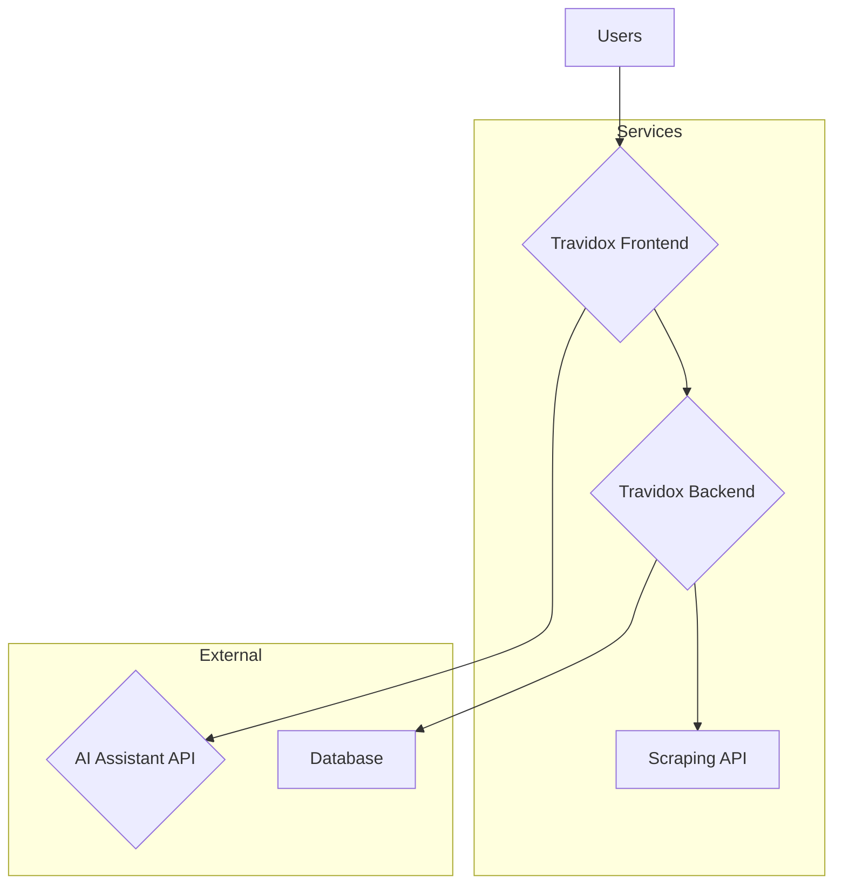

# Travidox Trading Platform

 <!-- It's recommended to add a banner image -->

Welcome to the official repository for **Travidox**, a modern trading intelligence platform designed for the Nigerian Stock Exchange (NGX). Our mission is to empower investors by combining a powerful web interface with AI-driven tools for insightful, data-backed trading.

---

## 📜 About The Project

Travidox is a multi-faceted platform consisting of a **Next.js frontend**, a **Python (FastAPI) backend**, and a dedicated **web scraping API**. It provides real-time stock data, virtual trading accounts, and an AI assistant to help users navigate the complexities of the market.

### Key Features

*   **Modern Web Interface:** A responsive and intuitive dashboard for monitoring the market.
*   **AI Financial Assistant:** Powered by Google's Gemini, our assistant offers market analysis, stock insights, and answers trading questions.
*   **Virtual Trading:** A sandboxed environment for users to practice trading strategies without financial risk.
*   **Real-Time Data:** Live market data for the Nigerian Stock Exchange.
*   **Secure & Scalable:** Built with modern architecture to ensure security and performance.

---

## 🏗️ Project Architecture

The Travidox platform is composed of three main services:

1.  **`travidox_frontend/`**: A Next.js application that serves as the user-facing dashboard. It communicates with our backend and the Gemini API.
2.  **`travidox_backend/`**: A Python-based service (likely FastAPI or Flask) that handles business logic, user data, and trading operations.
3.  **`Scarape_API/`** (assuming 'Scrape'): A dedicated Node.js service for scraping financial data from various web sources.

---

## 🚀 Getting Started

To set up the full Travidox platform, you will need to run each of the three services.

### Prerequisites

*   **Node.js** (v18 or later) for the Frontend and Scraping API.
*   **Python** (v3.9 or later) for the Backend.
*   **Git** for cloning the repository.
*   **Firebase Account** for database and authentication services.
*   **Google Gemini API Key** for the AI Assistant.

### Installation & Setup Guide

Each service has its own setup instructions. Please refer to the `README.md` file within each directory for detailed guidance:

*   **[Frontend Setup](./travidox_frontend/README.md)**
*   **[Backend Setup](./travidox_backend/README.md)**
*   **[Scraping API Setup](./Scarape_API/README.md)**

A general workflow is:
1.  Set up the backend and database first.
2.  Set up the scraping API to ensure data is flowing.
3.  Set up the frontend, which connects to the other services.

---

## 🤝 Contributing

We welcome contributions from the community! If you'd like to improve Travidox, please feel free to fork the repository, make your changes, and submit a pull request.

1.  **Fork the Project**
2.  **Create your Feature Branch** (`git checkout -b feature/NewFeature`)
3.  **Commit your Changes** (`git commit -m 'Add some NewFeature'`)
4.  **Push to the Branch** (`git push origin feature/NewFeature`)
5.  **Open a Pull Request**

Please make sure your code adheres to our coding standards and includes tests where applicable.

---

## 📄 License

This project is distributed under the MIT License. See `LICENSE` for more information.

---

## 📬 Contact

Project Maintainer - [Victor Jayeoba](https://github.com/victorjayeoba)

Project Link: [https://github.com/victorjayeoba/Travidox](https://github.com/victorjayeoba/Travidox)
